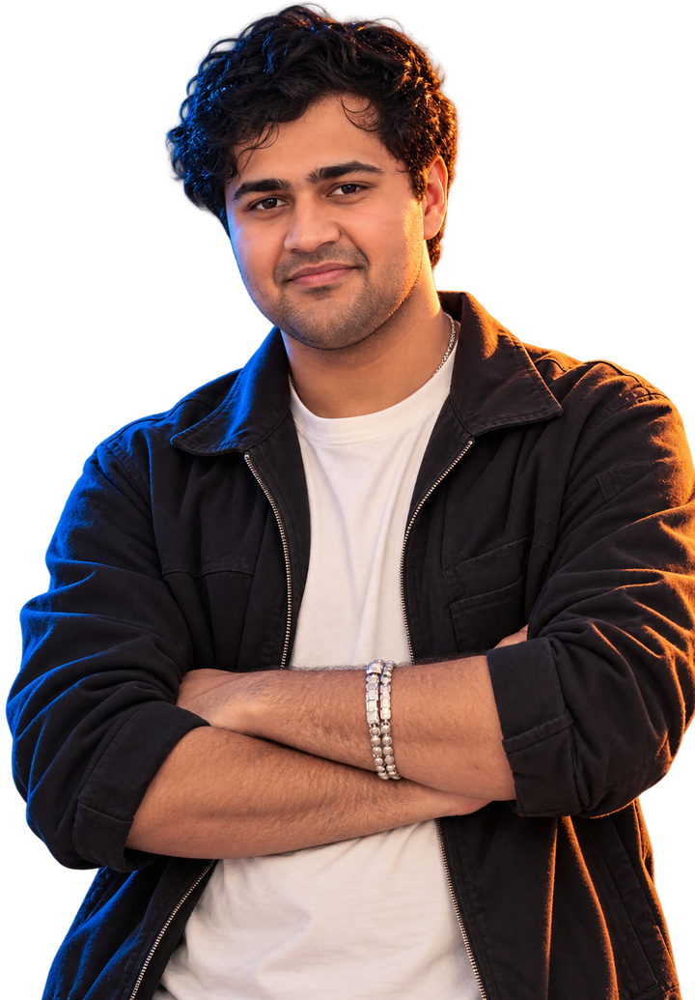
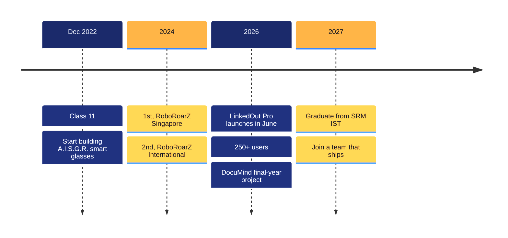

<table>
<tr>
<td colspan="2">

🔴 🟡 🟢 &nbsp; <picture><source media="(prefers-color-scheme: dark)" srcset="https://readme-typing-svg.demolab.com?font=JetBrains+Mono&weight=500&size=13&duration=1100&pause=99999&color=8A93B8&center=false&vCenter=true&repeat=false&width=520&height=24&lines=rishit%40srm++~++%25++open+profile.md"/></picture>

</td>
</tr>
<tr>
<td width="60%" valign="middle">

<picture><source media="(prefers-color-scheme: dark)" srcset="https://readme-typing-svg.demolab.com?font=JetBrains+Mono&weight=500&size=13&duration=700&pause=99999&color=8A93B8&center=false&vCenter=true&repeat=false&width=560&height=24&lines=AI+%C3%97+HARDWARE+ENGINEER++%2F++CHENNAI%2C+IN"/></picture> 
<picture><source media="(prefers-color-scheme: dark)" srcset="https://readme-typing-svg.demolab.com?font=Big+Shoulders+Display&weight=900&size=150&duration=700&pause=99999&color=F2F5FF&center=false&vCenter=true&repeat=false&width=560&height=130&lines=RISHIT"/></picture> 
 
 
&nbsp;&nbsp;&nbsp;&nbsp;&nbsp;&nbsp; 
 

</td>
<td width="40%" align="center" valign="middle">

</td>
</tr>
<tr>
<td colspan="2" align="center">

    

</td>
</tr>
<tr>
<td colspan="2" align="center">

<picture><source media="(prefers-color-scheme: dark)" srcset="https://readme-typing-svg.demolab.com?font=JetBrains+Mono&weight=500&size=15&duration=1400&pause=2600&color=C9D2F0&center=false&vCenter=true&repeat=true&width=860&height=110&multiline=true&lines=%24+status+--now;%3E+building+.......+DocuMind+%28final-year+major+project%29;%3E+last+shipped+...+LinkedOut+Pro%2C+250%2B+users;%3E+next+...........+SDE+%2F+AI-ML+role%2C+2027++%E2%97%8F"/></picture>

</td>
</tr>
</table>

 

<picture><source media="(prefers-color-scheme: dark)" srcset="https://readme-typing-svg.demolab.com?font=JetBrains+Mono&weight=500&size=16&duration=1400&pause=2500&color=C9D2F0&center=false&vCenter=true&repeat=true&width=460&height=170&multiline=true&lines=%3E+jarvis%2C+who%27s+this%3F;Rishit+Tandon.+Final-year+CSE%2C+SRM+IST.;Builds+AI+glasses%2C+drone+swarms%2C+BCIs.;12%2B+hackathon+wins.+6+first+places.;Open+to+SDE+%2B+AI%2FML+roles%2C+2027."/></picture>

  
  

 

 
<picture><source media="(prefers-color-scheme: dark)" srcset="https://readme-typing-svg.demolab.com?font=Big+Shoulders+Display&weight=900&size=54&duration=1500&pause=99999&color=F2F5FF&center=false&vCenter=true&repeat=false&width=820&height=70&lines=THINGS+THAT+LEAVE+THE+SCREEN."/></picture> 

<table>
<tr>
<td width="50%" valign="top">

`WEARABLE AI` 

Smart glasses I've been building since Class 11 with my co-founder. **6 AI agents on an ESP32-CAM**, **8 Indian languages**, run by **Jarvis**.

  

</td>
<td width="50%" valign="top">

`DRONE SWARM` 

Three drones, **Crux, Oberon and Capella**, coordinating disaster relief from the air.

 

</td>
</tr>
<tr>
<td width="50%" valign="top">

`LIVE SAAS` 

AI writes and schedules your LinkedIn posts. OAuth, Gemini captions, auto-publishing, analytics.

  

</td>
<td width="50%" valign="top">

`PAYMENTS PWA` 

Group expenses, settled over **UPI deep links** and **Razorpay**.

  

</td>
</tr>
<tr>
<td width="50%" valign="top">

`BRAIN-COMPUTER INTERFACE` 

A rover steered by EEG, decoded by a 1D CNN on Raspberry Pi + ESP32 + BioAmp EXG.

 

</td>
<td width="50%" valign="top">

`MARKETPLACE` 

Browse and buy AI agents, get an API key instantly.

  

</td>
</tr>
</table>

 

`NOW BUILDING` &nbsp;  
 
<picture><source media="(prefers-color-scheme: dark)" srcset="https://readme-typing-svg.demolab.com?font=JetBrains+Mono&weight=500&size=14&duration=1300&pause=3000&color=C9D2F0&center=false&vCenter=true&repeat=true&width=820&height=190&multiline=true&lines=%24+documind+scan+crumpled_invoice.jpg;%5B1%2F5%5D+agent+picked%3A+deskew%2C+denoise%2C+threshold;%5B2%2F5%5D+PaddleOCR+........................+done;%5B3%2F5%5D+entities+%E2%86%92+Neo4j+knowledge+graph+..+done;%5B4%2F5%5D+embeddings+%E2%86%92+ChromaDB+.............+done;%5B5%2F5%5D+hybrid+retrieval+%2B+verifier+.......+%E2%9C%93+answer+ready"/></picture>

<table>
<tr>
<td width="33%" align="center" valign="top"> `NOW` <b>DocuMind</b> final-year major project, agentic document intelligence</td>
<td width="33%" align="center" valign="top"> `NEXT` <b>SDE / AI-ML role</b> graduating 2027, looking for a team to build with</td>
<td width="33%" align="center" valign="top"> `ALWAYS` <b>Hackathons + hardware</b> if it doesn't exist yet, build it this weekend</td>
</tr>
</table>

 
<picture><source media="(prefers-color-scheme: dark)" srcset="https://readme-typing-svg.demolab.com?font=Big+Shoulders+Display&weight=900&size=54&duration=1500&pause=99999&color=F2F5FF&center=false&vCenter=true&repeat=false&width=820&height=70&lines=WINS%2C+NOT+WISHLISTS."/></picture> 

| | | |
|:--:|:--|:--|
|  | **RoboRoarZ Singapore 2024** | SUTD × IEEE |
|  | **SEISMO HACK 1.0** | National, with Arclyth |
|  | **RoboRoarZ International 2024** | James Dyson Foundation |
|  | **Best Innovation** | SRM ML Expo, NeuroVibe |
|  | **Research, SRM IST × NIDM** | Satellite-based glacial-flood early-warning ML |
|  | **SDE, DGTL Innovations** | |

 
<picture><source media="(prefers-color-scheme: dark)" srcset="https://readme-typing-svg.demolab.com?font=Big+Shoulders+Display&weight=900&size=54&duration=1500&pause=99999&color=F2F5FF&center=false&vCenter=true&repeat=false&width=820&height=70&lines=THE+STORY+SO+FAR."/></picture> 

 
<picture><source media="(prefers-color-scheme: dark)" srcset="https://readme-typing-svg.demolab.com?font=Big+Shoulders+Display&weight=900&size=54&duration=1500&pause=99999&color=F2F5FF&center=false&vCenter=true&repeat=false&width=820&height=70&lines=SILICON+TO+SAAS."/></picture> 

 
 
 

 

 
<picture><source media="(prefers-color-scheme: dark)" srcset="https://readme-typing-svg.demolab.com?font=Big+Shoulders+Display&weight=900&size=54&duration=1500&pause=99999&color=F2F5FF&center=false&vCenter=true&repeat=false&width=820&height=70&lines=SHIPPING+EVERY+DAY."/></picture> 

&nbsp;

&nbsp;

